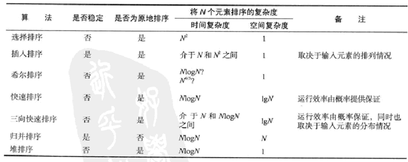

## 第二章 排序

---

#### 冒泡排序
> 定义：依次比较两个元素，如果位置错乱则交换，知道最大的元素交换到最右边，再依次交换找出第二大
 
- 普通sort方法的时间复杂度为O(n^2),不论最优最差
- 改进betterSort方法的最差时间复杂度是O(n^2)，最优是O(n)
- 使用于:较少元素，且对效率要求不高的情况

- 明显缺点是交换次数多，这个将有选择排序给优化这方面，
- 还有无论输入都将循环两次并且一次不少的比较

---

#### 选择排序
> 排序方法二：选择排序

- 定义：依次比较未排序的序列中的元素找出最小元素，然后将最小元素与未完成排序序列第一个交换，然后依次找下一个
- 普通sort方法的时间复杂度为O(n^2),不论最优最差，但交换次数是n，这个比冒泡排序有明显优势
- 使用于:较少元素，且要求交换较少的情况

- 明显缺点：无论输入情况，都将循环两次并且一次不少的进行比较， 插入排序将优化这方面

---

#### 插入排序
> 定义：假设左边已经排好，然后将第i位向左依次插入，直至左边比自己还小
 
- 普通sort方法的时间复杂度为最差是O(n^2),平均也是O(n^2),最好是(O(n))和0次交换
- 使用于:数组已经基本有序

- 明显缺点：对大数据的乱序序列排序依旧很慢，因为元素只能一点一点地从数组的一端移动到另一端  而基于插入排序的希尔排序将优化这方面

---

####  希尔排序
 
> 定义：使数组中任意间隔为h的元素都用插入排序变得有序，然后逐渐递减h直至1.

- 难点：怎么选择递增序列是一个难点
- 要想确切知道希尔排序的时间复杂度是很困难的，O(2nlogn) ~ O(n^2)  之所以写O(2nlogn)中的2是想表达比nlogn是慢的
- 使用于:希尔排序比插入排序和选择排序乱序下快的多，并且数组越大优势越明显

- 明显缺点：虽然希尔排序在乱序方面改进了插入排序，但当序列越有序的时候，对插入排序越有利

---

####  归并排序
> 定义：使用“分治”的思想，要排序一个数组，可以先（地柜地）将它分成两半分别排序.

- 时间复杂度在1/2NlgN - NlgN
- 还可以证明出：没有任何基于比较的算法能够保证使用少于lg(N!) - NlgN次比较将长度为N的数组排序.
- 进而证明：归并排序是一种渐进最优的基于比较排序的算法.
- 自下而上的归并排序适用于链表组织的数据
- 改进方向:对小规模子数组进行插入排序;测试数组是否已经有序;不将元素复制到辅助数组

- 明显缺点：需要额外空间和N成正比，即空间复杂度上不是最优解
- 有些不是基于可比较而进行的排序归并就不是最优解

---

#### 快速排序
> 定义：使用“分治”的思想，与归并排序是互补的，先将一个数组以切分元素的为中间值分成两组，进而递归对每个分组进行如上操作.
 
- 时间复杂度在NlgN - N^2/2,空间复杂度上lgN,但最糟糕的情况可以通过随机打乱数组来预防
- 快速排序所用时间比插入排序和选择排序一样多的概率非常非常小，可以忽略不计，几乎时原地排序，这比归并排序好

算法改进：  

- 小数组应该用插入排序
- 三取样切分，每次找到中位数
- 当重复元素过多，可以使用三分法，例如三向切分法，可以将复杂度变成（2ln2）HN，即从线性对数变成线性
 
---

#### 堆排序

> 定义：使用完全二叉树理论，先构造出堆有序，然后将最大值与最后元素交换，然后对第一个元素执行下沉排序

- 时间复杂度在O(NlgN),平均比快速排序和归并稍微慢点，但是原地排序，空间利用高，特别在嵌入式等方面

算法改进：
 
- 由于无法使用缓存[因为不是相邻比较关系]，所以没有其他排序[快排，归并等]用的广泛
 
---

> 以堆实现的优先级队列
 插入元素，删除元素的时间复杂度为O(lgN)
 
---

