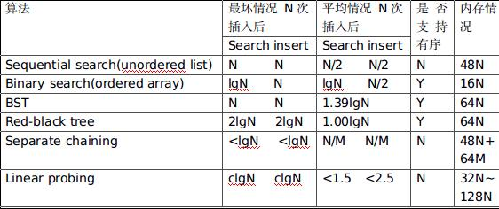

## 第三章 查找

---

#### 基于无序链表的 顺序查找
- 查找时间复杂度度平均 N/2 ,最坏N， 插入时间复杂度N
 
---

#### 有序数组的二分查找
- 查找时间复杂度lgN,插入时间复杂度最差2N，平均N，能保持有序性

---

#### 二叉查找树
- 二叉查找树(BST)：是一颗二叉树,其中每个结点都含有一个Comparable的建(以及相关联的值)且每个结点的键都大于其左子树中的任意结点的键，而小于右子树的任意结点.
- 二叉查找树的查找和插入的最坏情况是N，平均2lnN(~1.39lgN). 与树高成正比

- 删除结点的思想，是先找到右子树最小值，再替换其位置，然后递归更新结点的N值

---

#### 平衡查找树 -> 2-3树 -> 红黑二叉查找树
- 平衡查找树是指含有N各结点的树的树高时lgN.

2-3树插入和查找比较复杂，代码太多，用红黑树这种简单的数据结构表达实现它更好，特别时get方法直接就可复用二叉查找树的.

红黑二叉查找树:

- 红链接均为左链接
- 没有任何一个结点同时和两条红链接相连
- 该树时完美黑色平衡的，即任意空链接到根结点的路径上黑链接的数量相同
- 由于一颗大小为N的红黑树的高度不会超过2lgN,根结点到任意结点的平均路径长度为～1.00lgN
- 所以红黑树的最差查找和插入的时间复杂度时2lgN, 平均是1.00lgN

---

#### 散列表
> 用散列函数将被查找的键转化为数组的一个索引，然后用拉链法或线性探索法去处理碰撞冲突.

- 查找和插入理论上接近常数
- 空间和时间上需要做出平衡，一般比会比红黑树快很多。但具体还是要看哈希函数的计算效率，还有无法像查找树支持有序

散列表实现的难度:

- 良好的散列函数
- 难以支持有序性

拉链法 vs 线性探索法

- 线性探索法对删除操作难度较大
- 线性探索法必须必要的时候扩容
- 具体场景还要具体分析

---

